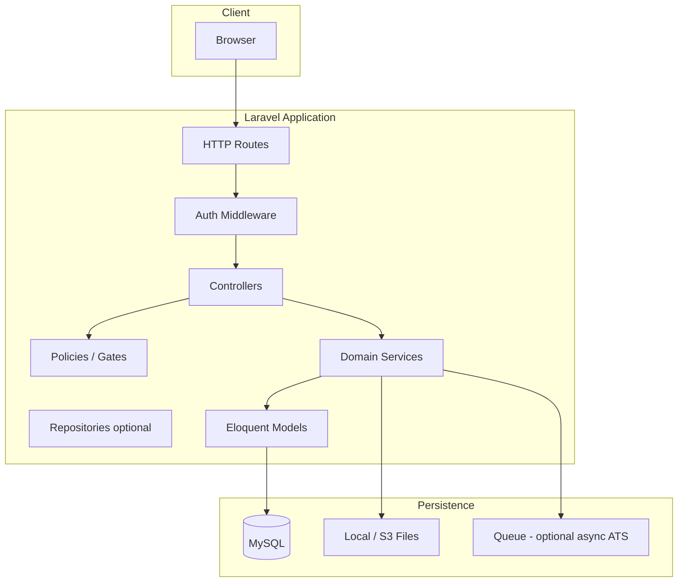

# ATS Analyzer — Project Architecture

This document describes the target architecture for a Laravel-based job application tracking and analysis tool. It aligns with the product requirements: multi-user access, a dashboard with analytics, a deferred ATS resume page, and full CRUD for job applications.

## 1. Goals and Scope

| Area | Requirement |
|------|-------------|
| **Auth** | Multiple users; secure authentication and authorization so users only access their own data (unless you later add admin roles). |
| **Page 1 — Dashboard** | Aggregate application counts (day / week / month / year); intuitive views of outcome status by country, platform, and period; support for pipeline stages. |
| **Page 2 — ATS** | Resume vs job ATS analysis; **testing phase** — feature-flagged, limited UI, or read-only stub behind permission. |
| **Page 3 — Applications** | List, create, update, delete job applications; capture rejection reason when outcome is rejected. |
| **Reference data** | **Countries** and **platforms** are stored in database tables (small curated sets) and are **manageable in-app** (create, update, delete or deactivate), with authorization and FK-safe rules (see `DATABASE.md`). |

## 2. High-Level System Architecture

- **Presentation**: Server-rendered Blade views, or Inertia + Vue/React if you standardize on a SPA stack (your repo may evolve either way).
- **HTTP layer**: Thin controllers; validation via Form Requests; authorization via Policies (and Gates for coarse features such as “can use ATS lab”).
- **Domain layer**: Dedicated service classes for dashboard aggregation and ATS orchestration keep controllers small and logic testable.
- **Data**: MySQL (as in `.env`); file storage for uploaded resumes when ATS is enabled.

## 3. Authentication and Authorization

### 3.1 Authentication

- Use **Laravel’s session-based auth** (e.g. Breeze or Fortify) for the web UI, or **Laravel Sanctum** if you expose a first-party SPA or mobile client.
- Password hashing via Laravel’s default `bcrypt` / `argon2`.
- Optional: email verification, 2FA (Fortify) for production hardening.

### 3.2 Authorization Model

- **Resource ownership**: Each `JobApplication` belongs to a `user_id`. Policies enforce `view`, `update`, `delete` only for the owner.
- **Reference data (countries & platforms)**: Expose CRUD only to trusted users—e.g. a Gate `manage-reference-data`, an `admin` role, or “all authenticated users” in a single-tenant internal tool. Use Policies on `Country` and `Platform` models. **Delete**: either restrict when `job_applications` still reference the row (database `RESTRICT` + friendly validation) or allow only **deactivation** (`is_active = false`) so history and dashboards stay consistent.
- **ATS “lab” page**: A Gate or permission (e.g. `use-ats-lab`) restricts the second page while in testing; can be tied to `users.is_beta` or a `role` / `permissions` package later.
- **Future admin**: Introduce `roles` / `permissions` (e.g. Spatie Permission) without changing the core ownership rule: admins bypass ownership in policy `before()` hooks.

### 3.3 Middleware

- `auth` on all application routes except login/register/password reset.
- Optional `verified` if email verification is enabled.
- Custom middleware for “ATS module enabled” if you use a global feature flag.

## 4. Application Structure (Laravel)

Suggested layout under `app/`:

| Layer | Responsibility |
|-------|----------------|
| `Http/Controllers/DashboardController` | Dashboard entry; delegates to `DashboardService`. |
| `Http/Controllers/JobApplicationController` | CRUD + index filters. |
| `Http/Controllers/CountryController` | CRUD (or resource) for `countries`; authorized users only. |
| `Http/Controllers/PlatformController` | CRUD (or resource) for `platforms`; authorized users only. |
| `Http/Controllers/AtsAnalysisController` | Stub or limited ATS flow; feature-flagged. |
| `Http/Requests/*` | Validation for store/update application, rejection rules, filters. |
| `Policies/JobApplicationPolicy` | Owner checks. |
| `Policies/CountryPolicy`, `Policies/PlatformPolicy` | Who may manage reference data. |
| `Services/DashboardService` | Time-series counts, breakdowns by country/platform/status/period. |
| `Services/AtsAnalysisService` | Parse resume/job, scoring (when implemented). |
| `Models/*` | Eloquent models and relationships. |

**Routes** (`routes/web.php`):

- `/` or `/dashboard` — dashboard (authenticated).
- `/applications` — resource routes for job applications.
- `/settings/countries`, `/settings/platforms` (or `/admin/...`) — resource routes for managing reference data (middleware: `auth` + `can:manage-reference-data` or equivalent).
- `/ats` or `/lab/ats` — ATS page (middleware: auth + optional `can:use-ats-lab` or feature flag).

**API (optional)**: Versioned JSON API under `routes/api.php` with Sanctum tokens if you need mobile or external consumers later.

## 5. Feature Modules

### 5.1 Dashboard

- **Inputs**: Date range or preset (week / month / year), optional filters: `country_id` / country scope, `platform_id`, `outcome_status` (values loaded from managed `countries` and `platforms` tables).
- **Outputs**:
  - Count series grouped by calendar day / week / month / year (use SQL `DATE_FORMAT` / week functions or Carbon bucketing in PHP for smaller datasets).
  - Breakdown charts: outcome status (`waiting`, `rejected`, `interview`, `success`) segmented by country and platform.
  - Optional funnel: counts per **pipeline stage** (current stage distribution).
- **Performance**: For large datasets, add database indexes (see `DATABASE.md`) and consider cached aggregates or materialized summary tables in a later iteration.

### 5.2 Job Applications (CRUD)

- Full create/read/update/delete with policy enforcement.
- When `outcome_status` is `rejected`, require `rejection_reason` (validated in Form Request).
- **Pipeline stage** is editable independently of outcome (e.g. still in `technical_interview` while outcome remains `waiting`).

### 5.3 ATS Analysis (Testing / Downgraded)

- Treat as a **separate bounded context**: upload, store file metadata, enqueue job (optional), persist analysis run and score.
- UI: banner “Testing”; reduced actions; no impact on core dashboard metrics unless you explicitly link `analysis_percentage` on the application from the latest run.
- Feature flag in `config/ats.php` or environment variable `ATS_MODULE_ENABLED=true|false`.

## 6. Cross-Cutting Concerns

- **Validation**: Central rules in Form Requests; reuse rule objects where fields repeat.
- **Localization**: Store canonical values on reference rows (`countries.code`, `platforms.slug`); display `countries.name` / `platforms.name` in the UI; inactive rows can be hidden from pickers while remaining available for historical charts.
- **Extensibility**: Use a `meta` JSON column on `job_applications` for fields not yet first-class (see database doc).
- **Auditing**: Optional `job_application_stage_histories` table to log stage changes for timeline UI and analytics.
- **Testing**: PHPUnit / Pest for policies, services, and critical aggregation queries.

## 7. Technology Stack (Reference)

| Component | Choice |
|-----------|--------|
| Framework | Laravel 10+ |
| Database | MySQL |
| Auth | Session (Breeze/Fortify) and/or Sanctum |
| Frontend | Blade with static `public/css` and `public/js` (no Vite/Vue in delivery path; Chart.js from CDN on dashboard). |
| Queues | Redis/database queue when ATS or exports become heavy |

## 8. Deployment Notes

- Run migrations and optional seeders for `countries`, `platforms`, and `pipeline_stages` so first deploy has usable pickers; teams may then maintain countries/platforms entirely in-app.
- Set `APP_URL`, database credentials, and feature flags in environment.
- Schedule optional `schedule:run` for nightly aggregate refresh if you add summary tables later.

---

See [DATABASE.md](./DATABASE.md) for the relational schema and indexing notes.
